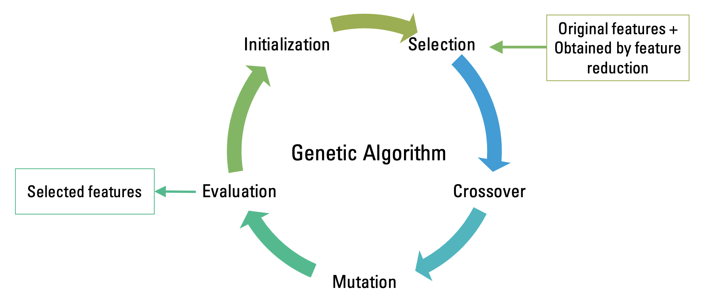

# Feature selection using constrained genetic algorithm 🧬
**Important note: this project was build for study purposes📚**

## Idea and motivation
**constrained-ga-for-fs** is a Python module for automated "wrapper" feature selection. The algorithm "wraps" subset of features around a specific model (random forest was implemented so far) and uses prediction accuracy of this subset as a criterion whether to select these features or not. The algorithm was constructed with the following premise:
> One probably may consider augmenting original set of features with some other ones obtained by **feature reduction algorithms** (like PCA, [Autoencoder](https://deepnote.com/@maksim-denisov-c524/Autoencoder-OPTUNA-uN_zBipkSf6xsDR6-1xpVA) and others). Since feature reduction algorithms "sqeeze" the most descriminative information from the data set (descriminative in terms of classification problems), in conjunction with the original data it may probably increase predictive ability (classification accuracy). After this has been done, the best subset of features can be found within the new augmented data. 
 
Taking into account this assumption, the genetic algorithm has two constraints:
1) The subset must have from 2 to 4 features from the original data;
2) The subset must also have from 2 to 4 features obtained by feature reduction algorithms (PCA, Autoencoder, e.t.c).

Therefore, the resulting subset of features is limited to the less than 8 features in total. Choice of 8 features is arbitrary and can be changed with a few changes in the code.
## Wrapper feature selection technique:

Image [source](https://commons.wikimedia.org/wiki/File:Feature_selection_Wrapper_Method.png#/media/File:Feature_selection_Wrapper_Method.png).

Basic idea of the "wrapper" feature selection algorithm is presented on the figure above. `Selecting the best subset` block is a genetic algorithm to `generate a subset` of features with Random Forest `learning algorithm`. Procedure can be described as follows:

0. *Population initialization*: each individual in the population is an array of the form - [0,0,0,1,0,1,...,1], where 1 means feature is chosen, 0 otherwise.
1. *Selection*
      1. Fitness evaluation: fitness function is the Random Forest algorithm with hyperparameter search by [Hyperopt](https://github.com/hyperopt/hyperopt). Fitness function is calculated for each individual in the population and returns the measure of the classification accuracy - `f1_macro` score.
      2. Adaptive penalty: as it was described earlier `constrained-ga-for-fs` module has two constraints. If the individual (subset of features) violates these constraints, then adaptive penalty is imposed as it is described in the paper [1]* (see **References** section below). 
2. *Crossover:* optional to choose 'OnePoint', 'TwoPoints' crossover or 'Uniform'.
3. *Mutation:* the gene to mutate is being selected randomly according to mutation probability.
4. *Evaluation*: all feasible solutions are collected to find the best one in the end.

Repeat 0-4 until convergence.

***References**
1.  Barbosa H. J. C., Lemonge A. C. C. An adaptive penalty method for genetic algorithms in constrained optimization problems. *Frontiers in Evolutionary Robotics.* 2008. Doi: 10.5772/5446.

### Genetic algorithm procedure to select features is depicted below:

[Image created by author]

# Install
```python
pip install git+https://github.com/MerelyMax/constrained-ga-for-fs.git#egg=constrained-ga-for-fs
```
# Example
```python
# pip install git+https://github.com/MerelyMax/constrained-ga-for-fs.git#egg=constrained-ga-for-fs --upgrade

from time import time
import numpy as np

from sklearn.ensemble import RandomForestClassifier
from sklearn.decomposition import PCA
from sklearn.preprocessing import MinMaxScaler
from sklearn.datasets import load_breast_cancer

from ga_for_fs import GeneticAlgorithm

if __name__ == '__main__':
    start = time()
    features, y = load_breast_cancer(return_X_y=True)

    # Implement PCA - feature reduction method
    pca = PCA(n_components=4)
    PCA_features = pca.fit_transform(features)

    # Scale features to the range of [0,1]
    scaler = MinMaxScaler(feature_range=(0, 1))
    features_scaled = scaler.fit_transform(features)

    # Augment original feature space concatenating PCA features
    constructed_f = np.concatenate((features, PCA_features), axis=1)

    # Feature selection constrained-ga-for-fs
    selector = GeneticAlgorithm(X=constructed_f,
                                y=y.astype(int),
                                estimator=RandomForestClassifier,
                                scoring='f1_macro',
                                cv=5,
                                n_population=15,
                                n_gen=20,
                                crossoverType='OnePoint',
                                mutationProb=1/constructed_f.shape[1],
                                initType='coin',
                                extraFeatures_num=4,
                                verbose=True)

    best_fitness, best_indexes, best_hyperparams = selector.startGA()

    print(
        f'best_f1_macro: {best_fitness}, best_indexes {best_indexes}, ind_best_hyperparam {best_hyperparams}')
    finish = time()
    print('')
    print(f'Passed time: {round((finish-start)/60, 4)}, min')
```
## Please note
Above example took .. min to finish calculations with sklearn n_jobs=-1 (processors: 8, RAM: 16 GB, system: macOS). More powerful systems will operate faster, less powerful slower.
